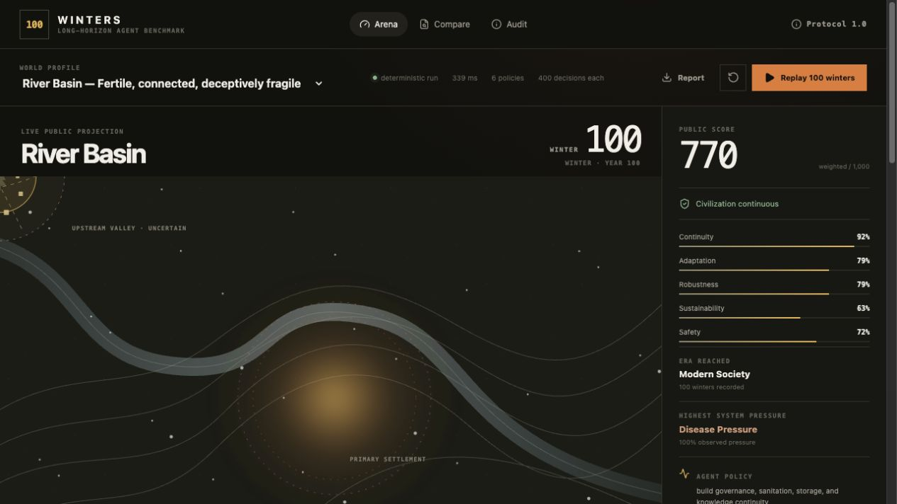
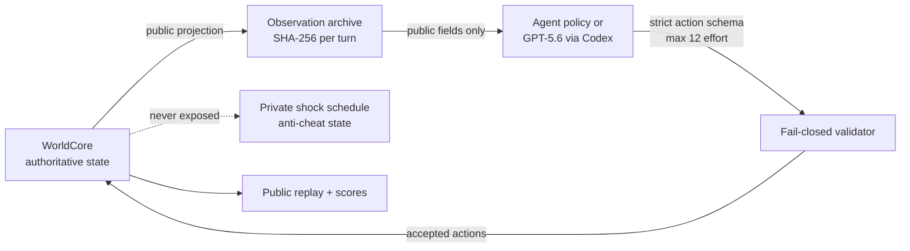

# 100 Winters

**A long-horizon benchmark for agents that must keep a civilization alive through compounding risk.**

[Live demo](https://alexzzz430.github.io/hundred-winters/) · [2:07 demo video](https://youtu.be/fRhGPnRTAtc) · [Judge guide](docs/JUDGE_GUIDE.md) · [Architecture](docs/ARCHITECTURE.md) · [Build Week change boundary](docs/BUILD_WEEK_CHANGELOG.md)

Most agent benchmarks ask whether a model can complete the next task. 100 Winters asks a harder question: **will the consequences of its decisions still be survivable a century later?**

The project runs six policies through 400 seasonal decisions in the same causal world. Every agent receives the same public observations and hidden shock schedule. The browser workbench lets you replay the world, compare policy divergence, and audit exactly what an agent knew at each decision.



## Try it locally

Requirements: Node.js 20 or newer.

```bash
npm install
npm run dev
```

Open `http://localhost:5173`. The browser demo is deterministic, runs entirely client-side, and requires no API key.

Useful commands:

```bash
npm test                 # 20 protocol, API, security, export, and adapter tests
npm run test:baseline    # full 400-turn / 100-winter River Basin matrix
npm run generate:demo    # regenerate inspectable sample report and replay files
npm run build            # production build
```

## What the benchmark measures

Each run begins with the same population, resources, observation contract, action budget, and private scenario schedule. The world evolves from the combined effects of decisions, extraction, regeneration, health, institutions, climate pressure, and scheduled shocks.

The final score combines seven dimensions:

- continuity;
- adaptation;
- resource efficiency;
- complexity reached;
- robustness;
- sustainability;
- safety.

A civilization can survive without advancing, advance while destroying its ecological base, or collapse after an apparently successful early run. Terminal collapse is penalized, so short-term extraction cannot win by hiding future debt.

### Reference result: River Basin

| Rank | Policy | Score | Winters | Era | Outcome |
|---:|---|---:|---:|---|---|
| 1 | Civic Memory | 769.65 | 100 | Modern complex society | Continuous |
| 2 | Stewardship | 654.19 | 100 | Early agriculture | Continuous |
| 3 | Drift | 640.33 | 100 | Foraging band | Continuous |
| 4 | Continuity | 638.42 | 100 | Foraging band | Continuous |
| 5 | Extraction | 425.33 | 100 | Foraging band | Continuous, 0 sustainability |
| 6 | Acceleration | 344.99 | 73 | Foraging band | Collapsed: public health |

These are deterministic benchmark results, not claims about real societies.

## Run a real GPT-5.6 Codex agent

The optional adapter uses an authenticated local Codex CLI. It sends only the archived public observation, requests a strict JSON action envelope, and runs Codex in a read-only, ephemeral sandbox.

```bash
npm run simulate:codex -- \
  --turns 4 \
  --model gpt-5.6-sol \
  --reasoning-effort medium \
  --profile river_basin \
  --output evidence/my-live-run.json
```

The checked-in [live run](evidence/gpt-5p6-live-run.json) was produced through the real Codex CLI on July 17, 2026. All four model decisions passed the action schema and budget validator. The run completed its first winter with a score of 498.74, food security of 0.9944, zero disease pressure, and four archived observation hashes.

The adapter deliberately has no fabricated fallback: malformed JSON, unknown actions, hidden-state fields, stale turns, and over-budget envelopes fail closed.

## Trust boundary



The public replay is rebuilt from accepted public events. Future shocks, judge nonces, causal truth, and anti-cheat state are excluded and covered by tests.

## Project map

- `src/world/` — causal simulation, profiles, private shocks, scoring, observation archive.
- `src/arena/` — six reference policies and fair multi-agent runner.
- `src/agents/codex-agent.js` — Codex CLI / GPT-5.6 structured-output adapter.
- `src/app/` — responsive Arena, Compare, Audit, and Protocol workbench.
- `src/api/` — restricted HTTP interface for external agents.
- `src/export/` — public and internal match artifacts.
- `public/demo/` — generated report and inspectable winner replay.
- `evidence/` — checked-in live GPT-5.6 run evidence.
- `test/` — 20 tests spanning causality, fairness, boundaries, export, API, and Codex integration.

More detail: [architecture](docs/ARCHITECTURE.md), [judge guide](docs/JUDGE_GUIDE.md), and [OpenAI usage](docs/OPENAI_USAGE.md).

## OpenAI Build Week boundary

The original local **Agent Survival Benchmark** was created on July 5, 2026. The immutable Git tag `pre-build-week-baseline` identifies that imported state. The browser workbench, 100-winter protocol, four world profiles, private shared shocks, new outcome model, GPT-5.6 evidence, product design, responsive UI, documentation, and publishing work were added during Build Week.

See the explicit [before/after changelog](docs/BUILD_WEEK_CHANGELOG.md). This distinction is intentional: only the meaningful Build Week extension is presented as new work.

## Limitations

- The browser baseline matrix uses transparent scripted policies so results are deterministic and inexpensive to inspect.
- A 400-turn live model run is possible but intentionally not the default because it invokes the model once per season.
- This is an agent evaluation environment, not a validated historical, economic, or ecological simulator.
- Scores are meaningful for comparisons within the same ruleset and profile, not across unrelated benchmarks.

## License and security

MIT licensed. See [SECURITY.md](SECURITY.md) for the threat model and disclosure process. No credentials, personal data, or private project assets are required by the browser demo.
