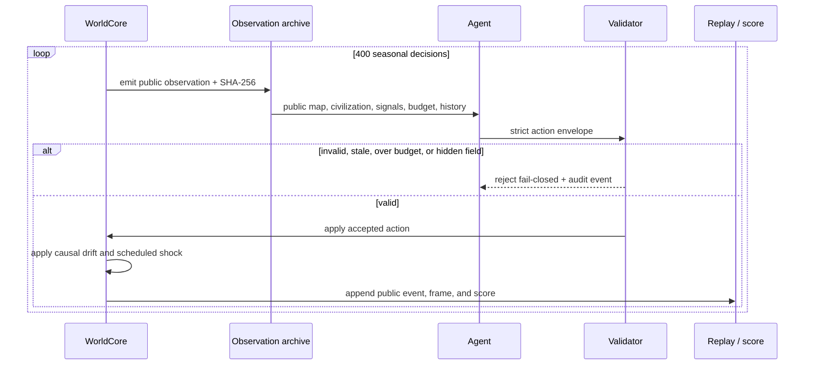

# Architecture

## System shape

100 Winters separates authoritative simulation, agent input, action validation, and public replay so the benchmark can make a precise claim about what an agent knew.

## Authoritative world

`WorldCore` owns the only mutable world state. It contains planet, ecology, settlement, civilization, risk, outcome, event log, observation archive, audit log, and score curve. The private state also holds the upcoming shock schedule, integrity nonce, and collapse streaks.

There is no privileged agent method. An agent receives `observe(agentId)` and submits one action envelope for the current turn. The core applies both chosen actions and natural consequences, then records the new public projection.

## Fair profiles

The four profiles change initial pressures and private events:

| Profile | Primary pressure | Public signature |
|---|---|---|
| River Basin | fragile abundance | temperate river, alluvial soil |
| Dry Ridge | water scarcity | arid ridge, aquifer, ore |
| Storm Archipelago | broken logistics | maritime storms, volcanic soil |
| Frost Steppe | continuity under cold | permafrost, short summer, herds |

Within a profile, every agent gets a fresh world with identical initial conditions and an identical shock schedule. The schedule is not included in observations. A shock becomes public only after it occurs.

## Action boundary

An envelope contains individual, community, civilization, and risk-control actions. Every action has a known type and positive effort. Total effort may not exceed 12.

The validator rejects:

- missing or malformed envelopes;
- stale turn numbers;
- unknown actions;
- non-positive effort;
- effort above the turn budget;
- any top-level field containing `hidden` or `judge`.

Rejection does not advance the world. Boundary violations are also written to the private audit log.

## Observation integrity

Every exact public observation is canonicalized and hashed with portable SHA-256 (`@noble/hashes`). The archive stores the turn, agent ID, hash, and payload. This works identically in Node.js and the browser bundle.

The public replay contains accepted public frames, observation payloads and hashes, and score curves. It excludes private state by construction; tests additionally scan exported payloads for hidden and judge fields.

## Codex and GPT-5.6 adapter

`CodexAgent` converts a public observation into a lean, outcome-focused prompt and invokes `codex exec` with:

- `--model gpt-5.6-sol`;
- `model_reasoning_effort="medium"`;
- `--sandbox read-only`;
- `--ephemeral`;
- `--output-schema <temporary JSON schema>`;
- `--output-last-message <temporary file>`.

The model output is parsed as strict JSON and passed through the same authoritative validator used for every other agent. Temporary schema and output files are removed after each decision.

## Browser workbench

The React/Vite client imports the same `ArenaRunner` and `WorldCore` used by the CLI tests. It does not ship a mocked result. Selecting a world profile executes six 400-turn policies locally, caches that profile for the session, and derives all views from the resulting public artifacts.

- **Arena** maps one selected public replay into a living terrain projection and metric rail.
- **Compare** plots all score curves and terminal outcomes.
- **Audit** shows the exact archived observation and hash for the selected decision.
- **Protocol** explains the scoring and provides the live Codex command.

## Reproducibility

Reference policies are deterministic. Profiles use recorded schedules rather than runtime randomness. A full baseline matrix therefore produces the same result on repeat runs of the same ruleset. A live model run is separately labeled because model outputs can vary.

